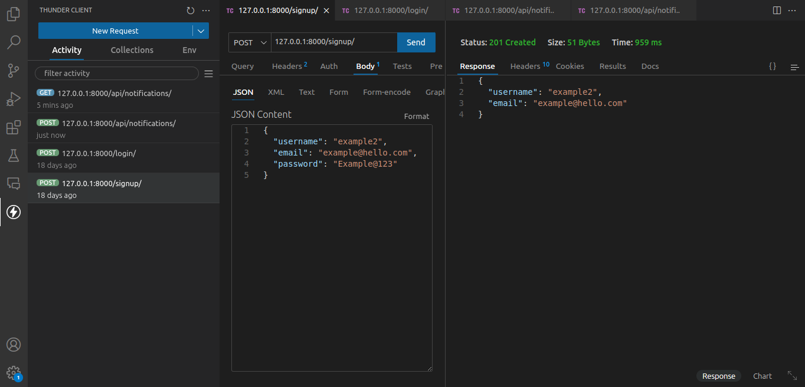
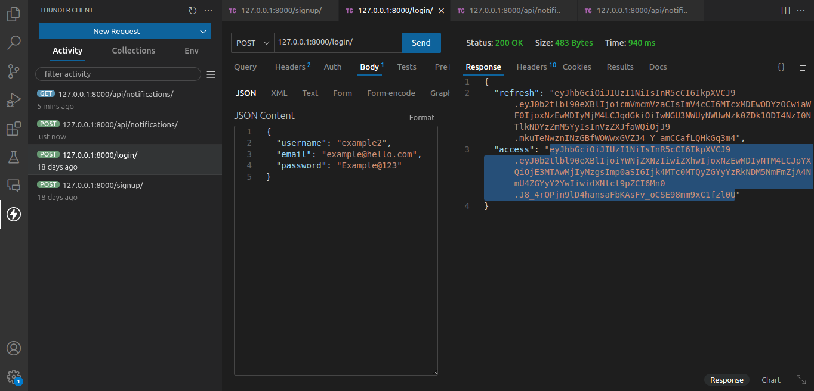
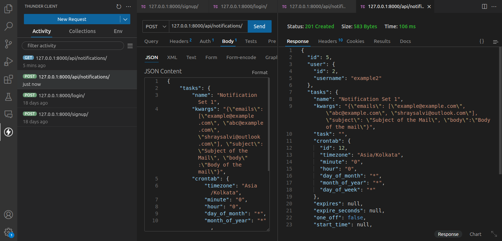
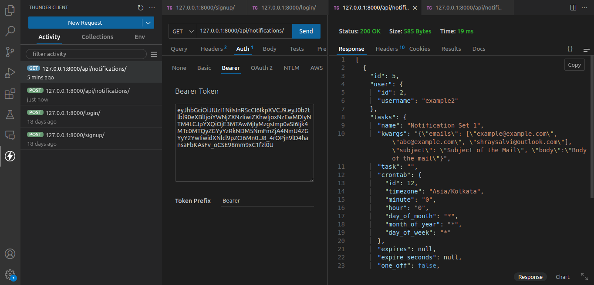

# Project Name

This is a Django Rest Framework project that provides API endpoints for user signup, login, and scheduling notifications.
Used django celery beat (crontabs) to schedule notification according to users need.

## Getting Started

These instructions will get you a copy of the project up and running on your local machine for development and testing purposes.

### Prerequisites

- Docker
- Docker Compose

### Installation

1. Clone the repository to your local machine:

```bash
git clone https://github.com/username/repository.git
```

2. Navigate to the project directory:

```bash
cd repository
```

3. Run Docker Compose:

```bash
docker-compose up
```

Now, the API should be running at `http://localhost:8000/`.

## Usage

You can access the API endpoints using Postman or the web view provided by Django Rest Framework.

Here are some screenshots to guide you through the process:

1. User Signup: 
   `http://localhost:8000/signup/`
2. User Login: 
   `http://localhost:8000/login/`
3. Notification Schedule Create: 
   `http://localhost:8000/notification`
4. Notification Schedule Get: 

Feel free to experiment with different requests to explore the functionality of the API.
